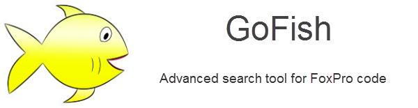
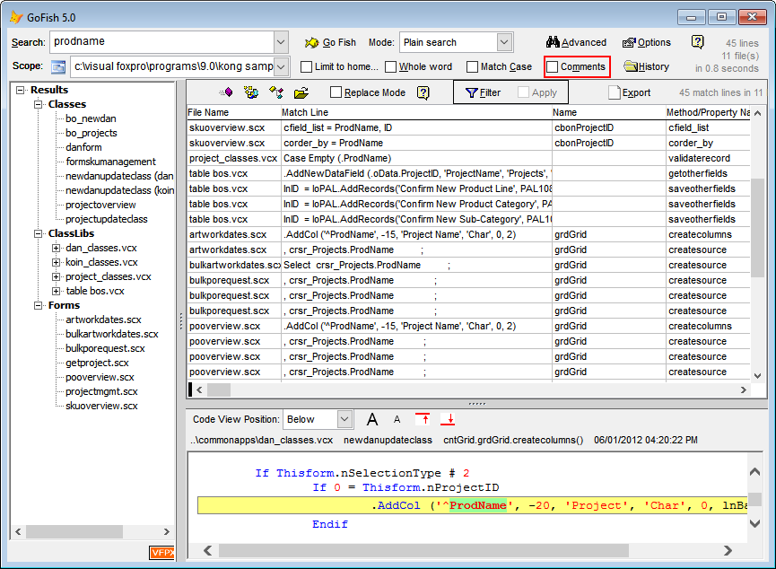

#  GoFish!
   
**Version 7.0.18 Released 2024-03-24** 

GoFish is an advanced code search tool for fast searching and replacing of Visual FoxPro source code.

[What's new in this release](docs\ChangeLog.md)

_Requires VFP9_

> Note: Matt's original repository is at https://github.com/mattslay/GoFish but since he sadly passed away in 2021, this fork is now the one the VFPX project list links to so others can contribute to the project. The main project is now https://github.com/VFPX/GoFish

### Synopsis
This is project is part of [VFPX](https://vfpx.github.io/) 

Project manager: Doug Hennig, [Jim Nelson](https://github.com/jimrnelson), [Lutz Scheffler](https://github.com/lscheffler)   
Project location: [GoFish](https://github.com/VFPX/GoFish)   

The main goal of this project is:
- Providing advanced code search search in code in Visual FoxPro source code
- Providing advanced replace 
- GoFish can search content on any other text file too, the difference is to deal with VFP table based sources   

### Videos
<a href="https://www.youtube.com/watch?v=0MdpWyPnfus" target="_blank">Getting started with GoFish</a>

### Audio Podcast
<a href="http://bit.ly/GoFish-On-TheFoxShow-Podcast-72" target="_blank">Hear The Fox Show podcast interview with GoFish author Matt Slay</a>

### Requirements
- Requires: Microsoft Visual Foxpro; Version 9.0 SP2.
- Runs with VFPA, compiling the APP with VP9 SP2 is recommended.

### Installation
#### Recommended
Install via [Thor](https://github.com/VFPX/Thor)
#### Directly
1. Download or clone this repository.   
3. Run `DO GoFish.app` in *source* subfolder

---
### Documentation
See [documentation](./docs/GoFish.md)
### Changes
See [changes](./docs/ChangeLog.md)
## Helping with this project
See [How to contribute to GoFish](.github/CONTRIBUTING.md) for details on how to help with this project.
### Bugs, Discussions etc.
The questions, bug reports, discussions forum [GoFish Discussion Group](http://groups.google.com/group/foxprogofish) is not longer maintained. Please use the [issues page](https://github.com/VFPX/GoFish/issues) on github.
### Known issues
Due to the way GoFish stores the code around the hits, the search may fail with memo file to large. See issue #49.  
This may happen as well, if too many results are visible in the history (with memo loaded).   
The search brings one hit per line, even if there is more then one hit in this line.
The replace function just replaces all hits per line. There is not hint about multiple hits at all.

----
Last changed: _2023/11/11_  